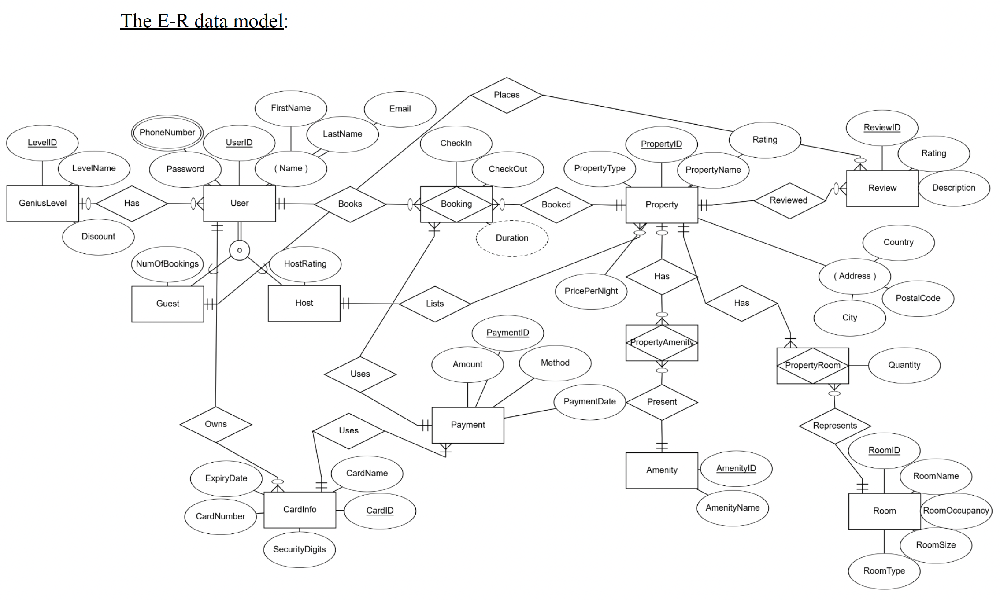
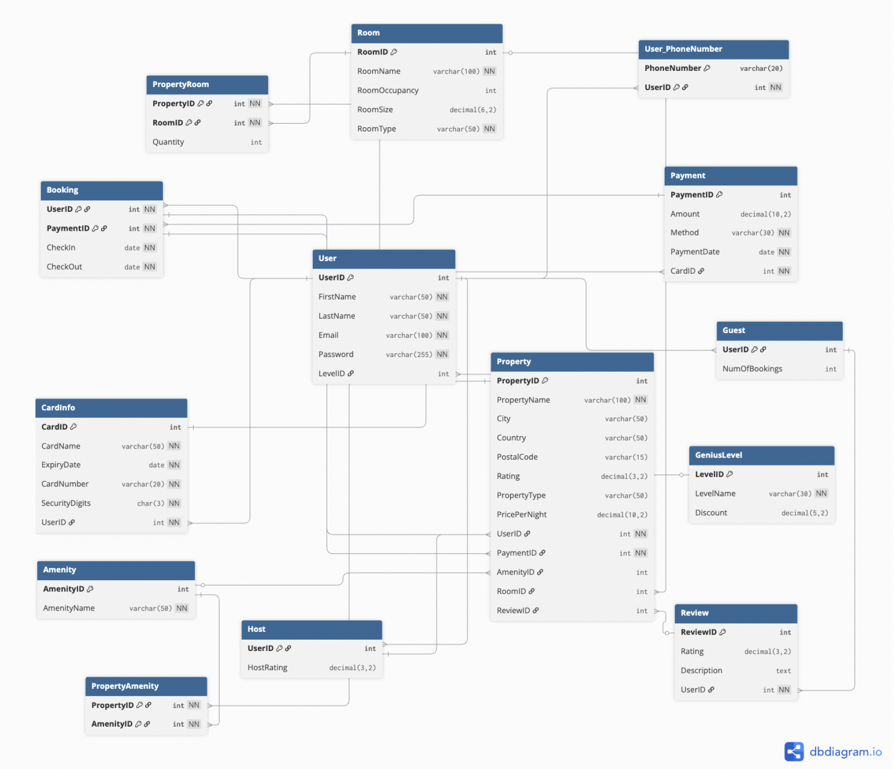

# Hotel Booking Database System

A comprehensive relational database system modeled after Booking.com's core functionality, designed to handle hotel reservations, property management, and user interactions at scale.

## 🎯 Project Overview

This project implements a normalized relational database schema that captures the essential features of a hotel booking platform, including user management (guests and hosts), property listings, room reservations, payment processing, reviews, and loyalty programs.

## ✨ Key Features

- **Dual User System**: Separate registration and authentication flows for guests and property hosts
- **Property Management**: Complete property and room listing system with amenities and availability tracking
- **Booking Engine**: Full reservation system with date validation and conflict prevention
- **Payment Integration**: Secure payment processing with stored payment methods
- **Review System**: Guest feedback and rating system for properties
- **Loyalty Program**: Genius-level rewards system for repeat customers
- **Advanced Search**: Multi-criteria property search with filtering capabilities

## 🏗️ Database Architecture

### Entity-Relationship Diagram


### Database Schema


### Entity-Relationship Model
The database follows a normalized design with proper foreign key relationships and data integrity constraints:

- **Users**: Guest and Host user management with role-based access
- **Properties**: Hotel and accommodation listings with detailed information
- **Rooms**: Individual room inventory with pricing and availability
- **Bookings**: Reservation management with date validation
- **Reviews**: Customer feedback system
- **Payments**: Secure transaction processing
- **Amenities**: Property features and facilities

### Key Design Decisions
- Implemented proper normalization to eliminate data redundancy
- Used cascading deletes for maintaining referential integrity
- Designed for horizontal scalability with indexed primary keys
- Separated user roles while maintaining unified authentication

## 🛠️ Technical Implementation

### Database Management System
- **Platform**: Microsoft SQL Server
- **Development Environment**: Visual Studio Code with SQL extensions
- **Design Tools**: ER diagram modeling and relational schema design

### Schema Highlights
```sql
-- Example table structure
CREATE TABLE Property (
    PropertyID INT PRIMARY KEY,
    PropertyName VARCHAR(100) NOT NULL,
    City VARCHAR(50),
    Country VARCHAR(50),
    PostalCode VARCHAR(15),
    Rating DECIMAL(3,2) CHECK (Rating >= 0 AND Rating <= 5),
    PropertyType VARCHAR(50),
    PricePerNight DECIMAL(10,2) CHECK (PricePerNight >= 0),
    UserID INT NOT NULL,
    FOREIGN KEY (UserID) REFERENCES Host(UserID)
);
```

## 📊 Advanced SQL Queries

The system includes sophisticated queries for business intelligence and application functionality:

- Revenue analysis by host and time period
- Property performance metrics and ratings
- User booking history and loyalty tracking
- Room availability and occupancy reports
- Dynamic pricing and inventory management

## 🎮 Demo Queries

### Revenue Analysis
```sql
-- Total revenue by host
SELECT 
    h.UserID,
    u.FirstName + ' ' + u.LastName AS HostName,
    SUM(p.Amount) AS TotalRevenue
FROM Host h
JOIN [User] u ON u.UserID = h.UserID
JOIN Property pr ON pr.UserID = h.UserID
JOIN Payment p ON pr.PaymentID = p.PaymentID
GROUP BY h.UserID, u.FirstName, u.LastName
ORDER BY TotalRevenue DESC;
```

### Property Performance
```sql
-- Top-rated properties by rating
SELECT 
    PropertyName,
    City,
    Country,
    Rating
FROM Property
ORDER BY Rating DESC;
```

## 🚀 Getting Started

### Prerequisites
- SQL Server 2019 or later
- SQL Server Management Studio or Visual Studio Code with SQL extension
- Basic understanding of relational databases

### Installation
1. Clone the repository:
   ```bash
   git clone https://github.com/mahyar-jbr/Hotel-Booking-Database-System
   cd Hotel-Booking-Database-System
   ```

2. Execute the database creation scripts:
   ```sql
    -- Run in order:
    -- 1. sql/schema/01-create-tables.sql
    -- 2. sql/data/sample-data.sql
   ```

3. Test with sample queries:
   ```sql
    -- Execute queries from sql/queries/ folder
   ```

## 📁 Project Structure

```
Hotel-Booking-Database-System/
├── README.md
├── LICENSE
├── .gitignore
├── docs/
│   ├── business-requirements.md
│   ├── er-diagram.png
│   └── database-schema.png
└── sql/
    ├── schema/
    │   └── 01-create-tables.sql
    ├── data/
    │   └── sample-data.sql
    └── queries/
        ├── revenue-analysis.sql
        ├── booking-reports.sql
        ├── property-analysis.sql
        └── operational-queries.sql
```

## 🎯 Learning Outcomes

This project demonstrates proficiency in:
- **Database Design**: ER modeling, normalization, and schema optimization
- **SQL Development**: Complex queries, joins, subqueries, and aggregate functions
- **Data Integrity**: Constraints, foreign keys, and referential integrity
- **Performance Optimization**: Indexing strategies and query optimization
- **Business Analysis**: Translating real-world requirements into data models

## 🤝 Contributing

While this is a personal project, I'm open to suggestions and improvements! Feel free to:
- Report issues or bugs
- Suggest performance optimizations  
- Recommend additional features
- Submit pull requests for enhancements

---

**Note**: This project demonstrates core database design principles and SQL development skills applicable to real-world e-commerce platforms.
